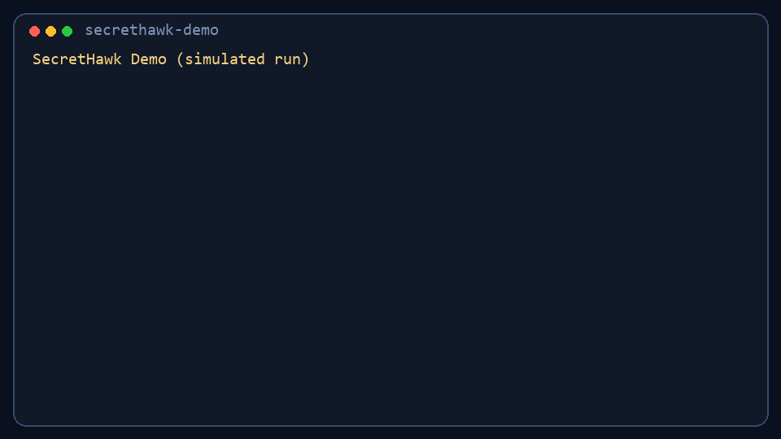

# SecretHawk

[](https://github.com/peter941221/SecretHawk/actions/workflows/go-ci.yml)
[](https://github.com/peter941221/SecretHawk/actions/workflows/secret-scan.yml)
[](https://go.dev/)
[](LICENSE)

SecretHawk is an open-source CLI for end-to-end secret incident handling:
detect, validate, rotate/revoke, patch, baseline, and report.

> Built for teams who want fewer false positives and faster incident closure.

## Start In 60 Seconds

```bash
go build ./cmd/secrethawk
./secrethawk.exe scan . --validate --fail-on high --fail-on-active
./secrethawk.exe remediate --auto
```

## Demo



Regenerate demo GIF:

```bash
python scripts/generate_demo_gif.py
```

## Why SecretHawk

- Detection is not enough. SecretHawk focuses on remediation flow, not only alerts.
- CI blocking can be noisy. SecretHawk can block on validated active findings.
- Small teams need practical workflows. SecretHawk ships with defaults and guardrails.

## Where It Fits

| Need | SecretHawk |
|---|---|
| Local dev + CI secret gate | Yes |
| Validity-aware CI blocking | Yes (`--fail-on-active`) |
| Rotate/revoke orchestration | Yes (connector-based) |
| Patch + baseline + incident report | Yes |
| Team governance workflow | In progress |

## Comparison Snapshot

| Capability | SecretHawk | Gitleaks | TruffleHog | GitHub Secret Scanning |
|---|---|---|---|---|
| CLI scan for repos/workspace | Yes | Yes | Yes | Partial (GitHub-centric) |
| Validation status in findings | Yes | Limited | Yes | Partial |
| Auto remediation workflow | Yes (current focus) | Limited | Limited | Guided process |
| CI fail on validated active | Yes | No (native equivalent) | Partial (custom logic) | Partial |
| Local-first OSS workflow | Yes | Yes | Yes | No |

Notes:
- This table is a practical positioning view for onboarding, not a benchmark.
- Each tool has strengths; many teams combine multiple tools.

## Incident Lifecycle

```text
[Scan]
   |
   v
[Validate]
   |
   v
[Rotate / Revoke]
   |
   v
[Patch Code]
   |
   v
[Update Baseline]
   |
   v
[Generate Incident Report]
```

## Features

- Multi-mode scanning: directory, staged, since, all-history.
- Outputs: human, JSON, SARIF.
- Validation states: active, inactive, unknown, error.
- CI gate controls: `--fail-on` + `--fail-on-active`.
- Remediation automation: connector-assisted rotate/revoke + patch + report.
- History cleanup command with safety checks.
- Growth workflow command group for campaign drafting with approval gates.

## Quick Start

### 1) Build and test

```bash
go test ./...
go build ./cmd/secrethawk
```

### 2) Run your first scan

```bash
./secrethawk.exe scan . --format human
./secrethawk.exe scan . --validate --fail-on high --fail-on-active
```

### 3) Run remediation flow

```bash
./secrethawk.exe remediate --auto
./secrethawk.exe report --input findings.json
```

### 4) Try growth workflow (optional)

```bash
./secrethawk.exe growth init --path .secrethawk/growth/campaign.yaml
./secrethawk.exe growth plan --brief .secrethawk/growth/campaign.yaml --output .secrethawk/growth/queue.json
```

## Command Map

```text
secrethawk
├── scan
├── validate
├── remediate
├── patch
├── history-clean
├── report
├── policy
│   ├── init
│   ├── check
│   └── test
├── connector
│   ├── list
│   ├── test
│   └── rotate
├── baseline
│   ├── create
│   └── update
├── growth
│   ├── init
│   ├── plan
│   ├── approve
│   └── export
└── version
```

## Connectors

- `aws`: validation + revoke + rotate (with rollback guard).
- `github`: token validation + revoke (with app-api fallback path).
- `slack`: manual-guidance connector.
- `stripe`: manual-guidance connector.

## CI Integration

- GitHub Actions CI: `.github/workflows/go-ci.yml`
- Secret scan gate: `.github/workflows/secret-scan.yml`
- Pre-commit example: `.pre-commit-config.yaml`

## Growth Workflow (Human-in-the-Loop)

```bash
./secrethawk.exe growth init --path .secrethawk/growth/campaign.yaml
./secrethawk.exe growth plan --brief .secrethawk/growth/campaign.yaml --output .secrethawk/growth/queue.json
./secrethawk.exe growth approve --queue .secrethawk/growth/queue.json --id x-01 --approver you
./secrethawk.exe growth export --queue .secrethawk/growth/queue.json --out-dir .secrethawk/growth/out
```

This command group intentionally keeps final publishing as a manual step for platform-policy safety.

## Who Should Use SecretHawk

- DevSecOps teams that need practical remediation, not only detection.
- Startups and indie builders with limited security headcount.
- Engineering teams adopting secret hygiene into CI/CD incrementally.

## Roadmap Snapshot

- Expand provider coverage for validation/remediation.
- Improve CI secret sync and governance controls.
- Add richer integration smoke tests and release automation.

## License

MIT. See [LICENSE](LICENSE).
